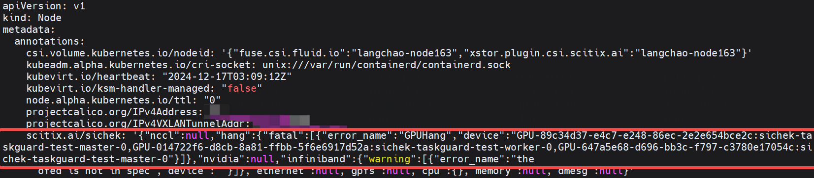
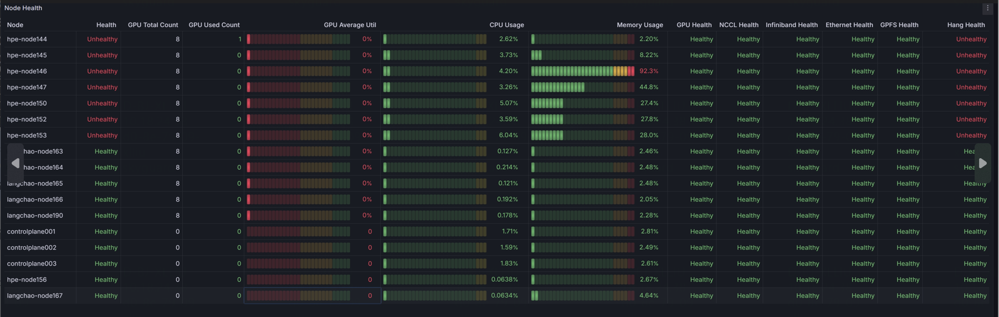

# Sichek

**Sichek** is a tool designed to **proactively detect and diagnose node health issues**, enabling early identification of potential hardware failures or performance bottlenecks. It provides visibility into node-level problems for upstream systems like Kubernetes cluster managers or task management platforms. This helps in the timely resolution of issues, allowing tasks to be rescheduled and ensuring high GPU utilization and operational efficiency.


---

## Table of Contents
- [Overview](#overview)
- [Features](#features)
- [Getting Started](#getting-started)
  - [Running in Kubernetes](#running-in-kubernetes)
  - [Running in Standalone Mode](#running-in-standalone)
- [Examples](#examples)
- [Health Check Errors](#health-check-errors)
- [Documentation](#documentation)

---

## Overview

AI training at scale is highly susceptible to interruptions caused by Hardware failures, System errors, or Software-related issues like NCCL errors or hanging processes occupying GPU resources.
These interruptions lead to Wasted computational resources,Extended training times and increased costs.

**Sichek** provides a comprehensive health monitoring and diagnostic solution to create a resilient AI training environment. It detects, categorizes, and reports node-level issues, ensuring minimal disruption to GPU-intensive workloads.  

By defining a series of health and performance detection rules, Sichek proactively identifies hardware, kernel, and software issues, monitors critical components, and makes these issues visible to upstream management platforms by adding a sichek annotation to k8s node annotatons, once node issues are detect.

---

## Features

- **Comprehensive Node Health Checks**  
  Real-time monitoring and diagnostics for critical hardware components:
  - **Nvidia GPUs**: Detect GPU losses, ECC errors, NVLink status, power and thermal issues, etc.
  - **Infiniband/Ethernet NICs**: Diagnose hardware errors, connectivity issues, and firmware inconsistencies, etc.
  - **CPUs**: Detect performance configuration errors, etc.
  - **PCIe Degradation**: Detect PCIe degradation to ensure high performance.
  - **System Logs**: Identify kernel deadlocks, corrupted file systems, and other critical errors.

- **Critical Software-related Issue Detection**  
  - **NCCL Errors**: Detect NCCL errors (e.g., NCCL timeouts) that may not immediately fail tasks but extend failure time.
  - **GPU Hangs**: Detect processes consuming GPU resources while in a failed state.

- **Issue Categorization and Automated Online Maintenance**  
  - Detect Nvidia GPU dependency errors (e.g., PCIe ACS not disabled, `peermem` module unloading, and `nvidia-fabricmanager` inactivity) and repair them online.
  - Categorizes issues to guide upstream recovery actions, such as task retries or node cordoning.

- **Integration and Reporting**
  - Full integration with Kubernetes monitoring and management tools (e.g., Prometheus, Grafana).
  - Export metrics and alerts for actionable insights by adding a `sichek` annotation to Kubernetes node annotations, enabling upstream task management platforms to detect task abnormalities and auto-retry tasks.

---

## Getting Started

### Running in Kubernetes
The easiest way to install sichek into your cluster is to use the Helm chart.
See [Sichek helm chart](./k8s/sichek) to deploy Sichek in your Kubernetes cluster.

- **For cluster diagnostics**, run Sichek using Kubernetes Job mode to start a batch of Sichek pods to diagnose multiple node health:
  ```bash
  helm install sichek-diag ./k8s/sichek --set  mode=diag --set batchjob.parallelism=2
  ```
    - **failed job** indicates failed node health check
    - **successful job** indicates passed node health check.

- *For cluster monitoring**, run Sichek using Kubernetes DaemonSet to start the Sichek service to monitor all nodes:

  ```bash
  helm install sichek ./k8s/sichek  # --set  mode=daemonset, default is daemonset
  ```
The daemon service will continuously monitor critical hardware components and write the results to the node's Kubernetes annotations when abnormalities are detected, as shown below:

  

Upstream management components can listen for sichek annotations on each node. Once an issue is detected, the tasks running on the node are checked, and if abnormal, the task will be failed and be retried.

### Running in Standalone Mode

#### Installaion

- install from the official release on Linux and amd64 (x86_64) machine:

  ```bash
  curl https://oss-ap-southeast.scitix.ai/scitix-release/sichek/install.sh |bash
  ```

- install from source

  ```
  make and make insall
  ```

#### Running Sichek manually for on-demand diagnostics:

You can trigger node diagnostics and get the results directly by running the following command:
  ```bash
  sichek all
  ```

  


You can also run individual components,  such as  `sichek gpu`, `sichek infiniband`, `sichek gpfs`, `sichek cpu`, `sichek nccl`, `sichek hang`. Run `sichek -h` for more options.

The output of the sichek command will display a summary of the check and detailed events if any errors are detected.


#### Running Sichek manually as a daemon service

To start Sichek as a daemon service by running the following command:

  ```bash
  sichek daemon start
  ```

## Examples
### Integration with Task Manager platform
A Kubernetes task management platform can implement a TaskGuard to handle task-level anomaly detection and automated rescheduling. The project provides a **TaskGuard Demo** for reference, which showcases the following capabilities:
- Listen for **scitix.ai/sichek annotation** on Kubernetes nodes.
- Handles anomalies like GPU failures or hangs or NCCL Errors:
  - If the associated task is already in a failed state, TaskGuard reschedules it.
  - If the task is still running, TaskGuard marks it as failed first, then attempts rescheduling to restore the training process. 

#### Running the TaskGuard Demo
Follow these steps to run the demo:

  ```bash
  cd test/e2e
  bash sichek-taskguard.sh
  ```

This demo simulates a complete integration workflow:
  - **Setup**: Starts the Sichek DaemonSet and the TaskGuard service.
  - **Workload Initialization**: Launches a pytorchjob with one master and one worker process.
  - **Simulating GPU Hang**: Sends a SIGINT signal to the main process of the pytorchjob worker, causing it to fail while the job remains in a running state.
**Expected Behavior**:

  - **Sichek Detection**: Sichek identifies the GPU hang and updates the Kubernetes node annotation `scitix.ai/sichek` with the status `GPUHang`.
  - **TaskGuard Response**: TaskGuard detects the anomaly, fails the `pytorchjob`, and reschedules it, ensuring the training process resumes without manual intervention.

This demonstration highlights how Sichek and TaskGuard together enable automated detection, failure handling, and recovery for GPU-intensive workloads.

### Intergration with Grafana

Sichek provides a Grafana dashboard template. Installing this template will automatically display the health status of all nodes with the Sichek service installed in the current cluster, as shown below:

  


## Health Check Errors
Sichek categorizes errors into three main types: **Fatal**, **Critical**, and **Warning**. Each error type includes a description and suggested corrective actions
- **Fatal**: Stop the task immediately and resubmit it.
- **Critical**: Cordon the node and fix hardware or software issues as soon as possible.
- **Warning**: Cordon the node and schedule hardware or software fixes at a convenient time.

For more information, refer to [Sichek Errors Categorization](./docs/errors-categorization.md).

## Documentation

For more information, please refer to the following documentation:

- [Sichek Architecture](./docs/architecture.md)
- [Sichek Nvidia](./docs/nvidia.md)
- [Sichek Infiniband](./docs/infiniband.md)
- [Sichek GPFS](./docs/gpfs.md)
- [Sichek Hang](./docs/hang.md)
- [Sichek Errors Categorization](./docs/errors-categorization.md)
- [Sichek Integration](./docs/integration.md)