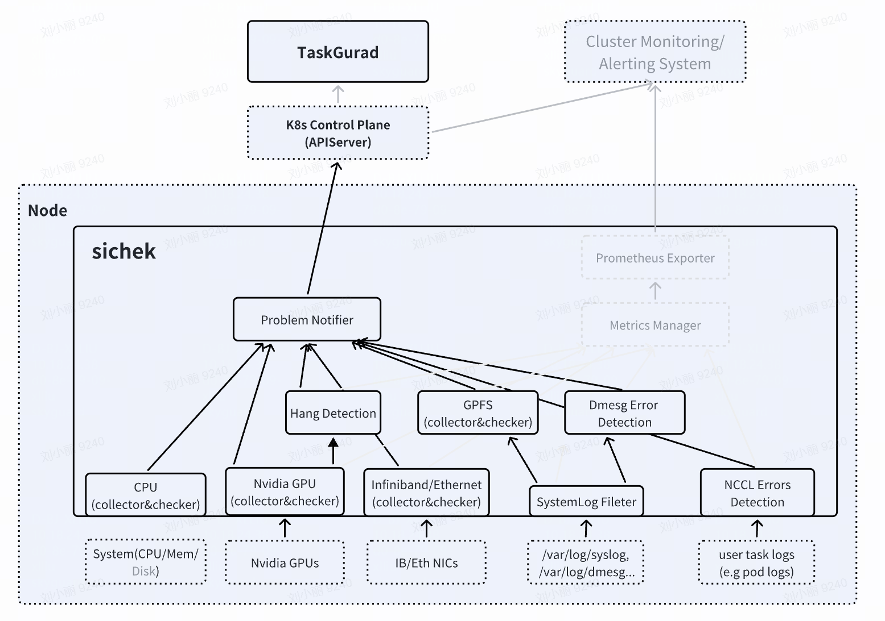

# Sichek Architecture

The **sichek** system is designed to monitor and maintain the health of individual nodes within a Kubernetes cluster. This document outlines the architecture of the system, focusing on its node-level components and functionality.

## overview

The architecture consists of several components working together to detect and report node issues at the node level. These components ensure effective problem notification and integration with Kubernetes systems.

Key components include:

- **Health Checker Components**: Collect metrics and perform health checks 

- **Problem Notifier**: Central handler for node health issues

## Sichek Components

### 1. Health Checker Components

The sichek module resides on each node and monitors various aspects of the node's health. It comprises the following submodules:

- **CPU**

    - Tracks CPU, memory, and disk usage.

    - Detects issues like performance bottlenecks and CPU lockup events.

- **Nvidia GPU**

    - Monitors the health and performance of Nvidia GPUs.

    - Detects GPU losses, ECC errors, or GPU crashes.

- **InfiniBand/Ethernet**

    - Monitors the health and performance of network interfaces.

    - Checks for connectivity issues or performance degradation.

- **Hang Detection**

    - Identifies if GPU is hanging, becoming unresponsive.

- **GPFS**

    - Monitors the GPFS (General Parallel File System) for errors or anomalies.

- **Dmesg Error Detection**

    - Analyzes Dmesg logs to detect kernel or hardware-level errors.

- **NCCL Errors Detection**

    - Focuses on detecting NCCL (NVIDIA Collective Communications Library) errors from user task logs (e.g., pod logs).

- **SystemLog Filter**

    - Analyzes logs from /var/log/syslog, /var/log/dmesg, and other sources to identify kernel or hardware-level errors.

### 2. Problem Notifier

The Problem Notifier is a central component that :
- gathers health reports from various health checkers

- Sends notifications about identified issues to the Kubernetes Control Plane via the API Server. Updates the Kubernetes node annotations with relevant issue details (e.g., sichek.ai/sichek annotation).

## Conclusion

The Sichek architecture ensures robust monitoring and management of node health in Kubernetes clusters. By integrating node-level monitoring with Kubernetes annotations, it provides administrators with a reliable solution for maintaining cluster stability and reliability.

